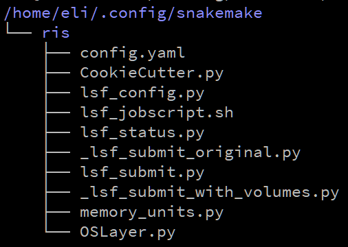

# Setting up Snakemake on the [WUSTL RIS cluster](https://ris.wustl.edu/services/compute/)

## Storage considerations
The RIS compute consumption model has several [storage options](https://confluence.wustl.edu/display/ITKB/Data+Storage+Platform).

* Archive storage
* Active storage
* Scratch space

The scratch space (which should be considered volatile) is the only storage suitable for Snakemake. This applies to the general compute infrastructure and may not be applicable to compute condos (custom servers stored at RIS).

### Reasons Active storage is unsuitable for Snakemake
* The path to Active storage as it appears to users is different than how Python resolves the path. Using Active tier would require intermediate rewriting of paths to make it work.
* The Active storage is caching storage. When cluster usage goes up, the caching speed goes down. This will lead to intermittent failure of your workflows using the same code since the caching hasn't caught up with all the stored files.

For these reasons, you should run projects in your scratch space, then move the data to the Active tier for review and sharing.

## Global setup

### Installing Snakemake
You can't use Snakemake without installing it for your user.

```bash
python3 -m install snakemake==6.15.5
```

You can, of course, use a more recent version of Snakemake. However, you have to build Docker images that use the same Snakemake version.

**Consistency between the cluster login node version of Snakemake and the Docker image version of Snakemake is critical.**

### Snakemake cluster job management
For the compute cluster, jobs aren't run directly. The RIS cluster is managed using [LSF](https://www.ibm.com/support/pages/what-lsf-cluster) and job requests are submitted via the [bsub](https://www.ibm.com/docs/en/spectrum-lsf/10.1.0?topic=reference-bsub) command.

Snakemake is designed with [cluster compute](https://snakemake.readthedocs.io/en/stable/executing/cluster.html). All that is required is setting a profile that defines how jobs are submitted and monitored. The relevant code is derived from the Snakemake [LSF profile project](https://github.com/Snakemake-Profiles/lsf). It has been modified slightly to update the exported LSF volumes that may be required by a project.

To install the profile, copy the ris subfolder into your snakemake config directory. The final layout should  be:

/home/USER/.config/snakemake/ris



**What does this profile do?** It defines the ways in which jobs are submitted to bsub and how to check for job completion. All of this is handled in the background when you run Snakemake with the profile.

## Project setup

### lsf.yaml
The compute cluster runs entirely in Docker images, so there has to be a way to specify what images to run for what rules. For each project, at the same level as the Snakefile specifying the workflow, should be a file named "lsf.yaml". It's used to specify run times, docker images, compute group, etc. Essentially all the information you would need to manually tell bsub. Example:

```yaml
__default__:
  - "-G compute-YOURCOMPUTEGROUP"
  - "-W 03:59"
  - "-a 'docker(thatdnaguy/r_for_cluster:latest)'"

long_running:
  - "-W 23:59"

rnastar:
  - "-a 'docker(thatdnaguy/rnastar:latest)'"
```

In that example, all rules are run for the specified compute group (compute-YOURCOMPUTEGROUP), with a run time of up to 3 hours 59 minutes (-W 03:59), using an R docker image (-a 'docker(thatdnaguy/r_for_cluster:latest)').

The rule named "long_running" in the Snakefile will use a time of nearly 24 hours. The rule named "rnastar" in the Snakefile will use an image with RNASTAR installed. At a bare minimum, an lsf.yaml must be included that specifies your compute group and a default Docker image.

### lsf_volumes.txt
This file is NOT required. The modified ris profile automatically exports the current scratch storage as an LSF_VOLUME. This will only work on the RIS scratch volumes, not on Active tier storage.

When this file is included, it should be a plain text file with one directory per line. Each directory is added to the LSF_VOLUME export when the workflow is run. For example, when running R workflows you should export your home directory so that R libraries can be installed and read from there. Example lsf_volumes.txt:

```bash
/home/USER
```

A workflow example is shown in the project sub-directory of this repository.

### Running a project
Once you have installed Snakemake and setup any necessary info in lsf.yaml and lsf_volumes.txt, running the workflow just involves using Snakemake as normal, but making sure to include the profile command.

```bash
snakemake --profile ris
```
